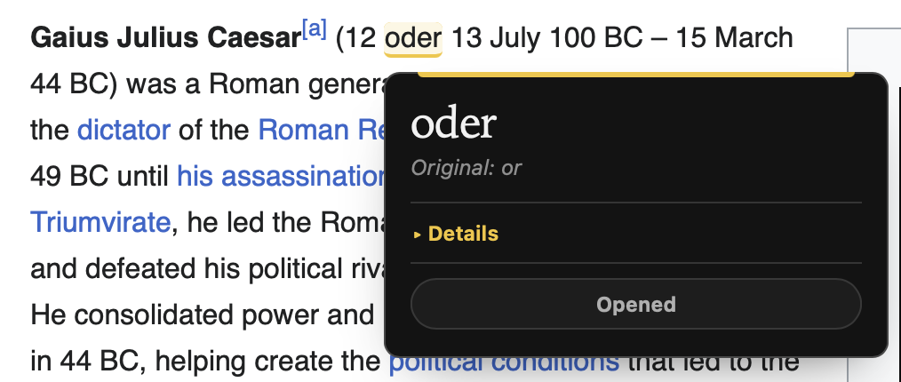
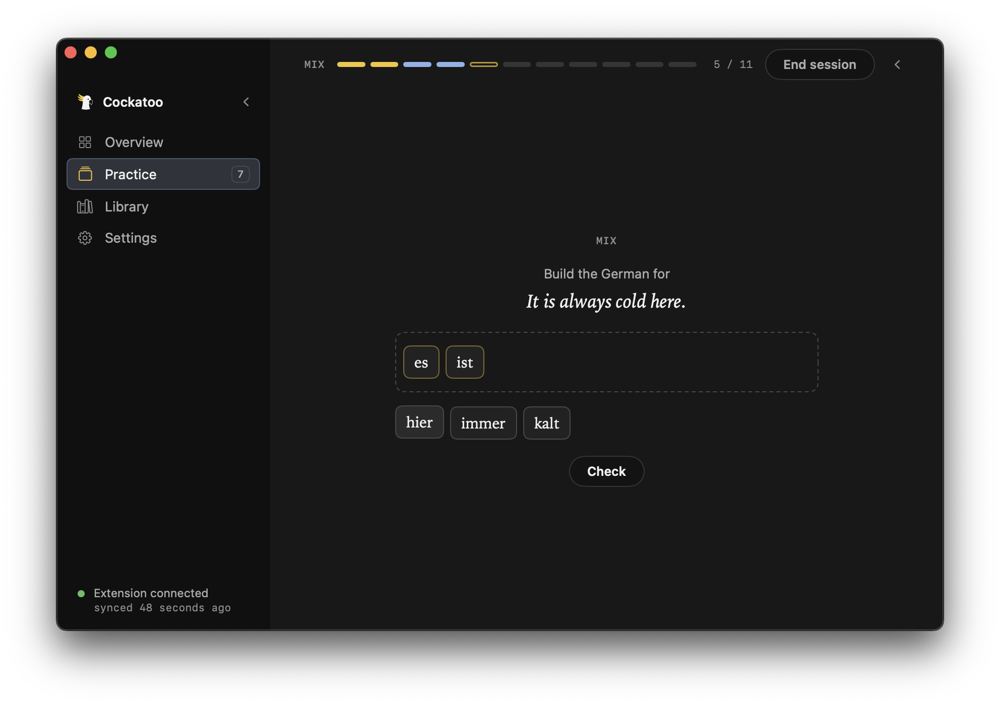
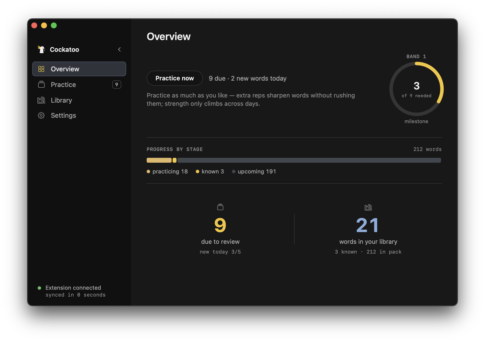
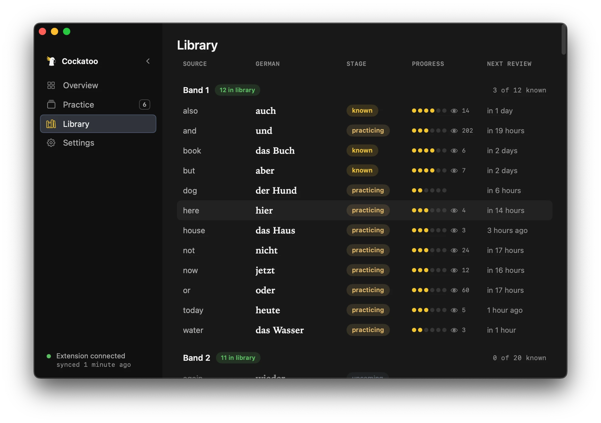
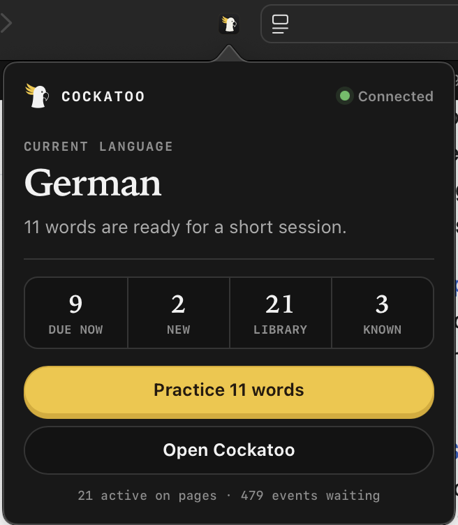

# Cockatoo

**Learn a language while you read the web.** Cockatoo swaps a few English words on
the pages you already read for their translations. Hover any swapped word to see
the original. A local macOS app owns your vocabulary, practice, and progress; the
Safari extension just shows what the app decides.

No streaks, no notifications, no "time to practice." The language arrives inside
your normal reading, at a low enough density that comprehension holds.

> **Status: early developer preview.** The source, tests, and full build and
> practice loop work today. There is no signed, notarized download yet, and some
> areas (practice especially) are still evolving. Contributions are welcome; see
> [Contributing](#contributing).

<table>
  <tr>
    <td width="50%" valign="top" align="center">
      
      <br><sub><em>One word on the page is German. Hover it for the original and its meaning.</em></sub>
    </td>
    <td width="50%" valign="top" align="center">
      
      <br><sub><em>Short daily practice sessions, here building a sentence from word tiles.</em></sub>
    </td>
  </tr>
</table>

## Quick start

**Set it up with a coding agent.** Paste this into Codex, Claude, Cursor, or a
similar agent to clone and configure Cockatoo:

```text
Set up Cockatoo, a local-first macOS language app (a SwiftUI app plus a Safari extension), from https://github.com/Daniel-Goatman/cockatoo

1. Clone it: git clone https://github.com/Daniel-Goatman/cockatoo.git && cd cockatoo
2. Read README.md and docs/setup.md, then follow the setup guide.
3. Check the toolchain: script/doctor.sh   (needs macOS 15.6+, Xcode 26+, Node 20+, Git)
4. Install dependencies: script/bootstrap.sh
5. Run the app on its own (no Apple account needed): swift run CockatooDev
6. For the full Safari extension you need an Apple Development team and a shared App Group. Copy App/Config/Local.example.xcconfig to App/Config/Local.xcconfig, set the team, bundle id, and App Group, run script/install-dev.sh, then enable Cockatoo in Safari > Settings > Extensions.
7. Verify everything: script/check.sh

Follow the rules in AGENTS.md. The most important one: Swift owns all learning logic; the extension only renders and reports.
```

**Set it up yourself.** The full walkthrough is in the
[setup guide](docs/setup.md). The short version:

```sh
git clone https://github.com/Daniel-Goatman/cockatoo.git
cd cockatoo
script/bootstrap.sh
swift run CockatooDev
```

Running the Safari extension needs an Apple Development team and a shared App
Group. The [setup guide](docs/setup.md) covers it step by step.

## See it in action

<p align="center">
  
  <br><sub><b>Overview.</b> What is due and your progress at a glance.</sub>
</p>

<p align="center">
  
  <br><sub><b>Library.</b> Every word, its stage, strength, and next review.</sub>
</p>

<p align="center">
  
  <br><sub><b>Extension popup.</b> Active language, live counts, and a one click session.</sub>
</p>

## The idea

Cockatoo teaches the words you are most likely to actually meet online, in
frequency order, so your progress shows up on real pages fast. It favors useful,
meaningful vocabulary and phrases over textbook order. Seeing a word on a page
reinforces it; short practice sessions are what make it stick.

## How it works

Cockatoo has two halves that share one source of truth. The Swift app owns every
learning rule: scheduling, grading, progress, and pack import. The Safari
extension is a renderer that receives a snapshot of what to show and reports raw
exposure events. No rule is written twice.

```text
Safari page
  -> TypeScript extension       renders swaps, reports events
  -> Safari app extension       forwards messages
  -> macOS app + LearnerCore    all learning logic
  -> SQLite + language pack
```

- **In-page swaps.** The extension swaps a budgeted few words per page (about one
  per 40 words, 3 to 20 in total), only outside inputs, code, and sensitive
  sites. Each swap is marked and hoverable. Word forms are matched from a table
  the pack author builds, so the extension never conjugates anything itself.
  More in [docs/plan/05-extension.md](docs/plan/05-extension.md).
- **Practice.** Sessions are short (about 10 questions) and move words through
  *practicing*, *known*, and *mastered*. There are five question types:
  recognition, recall, cloze, sentence rebuild, and a self graded production
  card. A word advances at most one step per day, so extra practice sharpens it
  without cramming. More in
  [docs/plan/10-learning-redesign.md](docs/plan/10-learning-redesign.md).
- **Honest about grammar.** A German word inside an English sentence cannot
  always be perfectly inflected. Cockatoo teaches vocabulary and noun gender
  first, marks every swap, and labels how faithful each one is. Verbs stay in
  practice only for now. More in
  [docs/plan/09-open-problems.md](docs/plan/09-open-problems.md).
- **Local first.** The app ships with no network calls and no API key. Language
  models help only offline, when authoring packs. A grammatical placement helper
  and an optional tutor are being explored, both opt-in. More in
  [docs/plan/06-llm-integration.md](docs/plan/06-llm-integration.md).

## Language packs

Cockatoo ships with a German starter pack (version 2026.10): 212 words and
phrases across frequency bands, each with example sentences. A small Spanish
sample proves the same pipeline works for any language with no language specific
code. To create or expand a pack, see [packs/README.md](packs/README.md).

## Contributing

Cockatoo is early and contributions are welcome, from bug fixes to whole language
packs. Start with [CONTRIBUTING.md](CONTRIBUTING.md). The areas that would help
most right now are practice design, language packs, in-page verb coverage, and a
Chrome port of the extension core.

## License

Cockatoo is licensed under the
[PolyForm Noncommercial License 1.0.0](LICENSE). You are free to use, modify, and
share it for personal and other noncommercial purposes. Commercial use is not
permitted.
</content>
