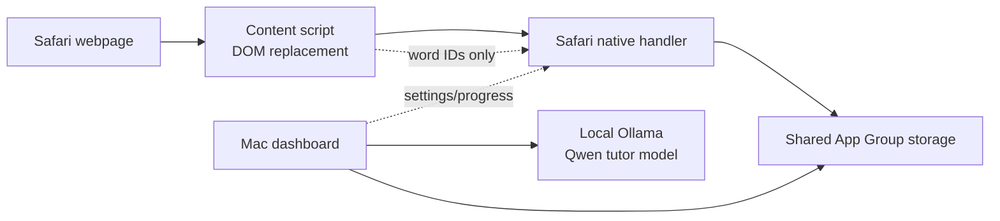

# Mac Language Learner: Product Overview And Wireframes

Date: 2026-05-27
Audience: product/design implementation
Scope: German-only, near-beginner-first, Safari inline learning MVP with local Ollama tutor path.

## Product Thesis

Mac Language Learner is a local-first German learning companion for people who
already spend time reading on the web. It should make German feel present during
normal reading without turning every page into a lesson. The core experience is
sparse inline word replacement in Safari, backed by a native Mac dashboard that
tracks progress, vocabulary, reviews, and local tutor settings.

The app should feel calm, lightweight, and optional. The learner should never
feel trapped in an exercise. Every intervention should be easy to ignore,
pause, inspect, or turn into a deeper tutoring moment.

## Current Product Boundary

- Supported language: German only.
- Default learner level: near beginner.
- Supported reading surface: Safari webpages and Safari-created web apps.
- Guaranteed content type: article/document-style pages with normal paragraph text.
- Beta content type: rich web apps such as Discord Web and WhatsApp Web, only if wrappers survive rerenders cleanly.
- Not supported in v1: passive replacement inside native Notes, Codex, Discord desktop, WhatsApp desktop, or arbitrary macOS apps.
- Local model path: Ollama with cached Qwen GGUF model, registered as `mac-language-learner-qwen2.5`.

## System Shape



### Responsibilities

- Safari content script: finds safe text nodes, inserts inline learning spans, restores DOM when paused/blocked, shows hover/focus card.
- Safari toolbar popup: fast page-level controls such as pause and disable site.
- Native Mac app: central dashboard, settings, vocabulary library, progress, review queue, tutor chat, local model configuration.
- Ollama: local tutor model for short explanations, examples, grammar clarifications, and retrieval prompts.
- Shared storage: app/extension state exchange, no raw page text.

## Visual Language

Design direction should be mature, calm, and high-signal.

- Avoid gamified clutter. Use progress and review cues, not streak pressure.
- Use soft highlight treatments that integrate with page text.
- Prioritize legibility over decoration.
- German words should feel like natural annotations, not warning labels.
- Tutor UI should feel like a patient coach, not a generic AI chat product.
- Use compact, glanceable microcopy. The user is reading something else.

## Core Native App

The native app is the central dashboard. It should not look like an installer
shell. It is where the learner understands progress, reviews words, manages
sites, and talks with the local tutor.

### App Navigation

Recommended primary navigation:

- Overview
- Learn
- Vocabulary
- Tutor
- Sites
- Settings

For the current implementation, Overview/Vocabulary/Sites/Settings already
exist. Tutor is now the first implemented local-model surface. Learn/reviews are
the next major product surface.

### Window

Default window:

- Minimum: 900 x 650.
- Comfortable target: 1100 x 760.
- Sidebar width: 220-260.
- Content should scroll vertically where needed.
- Avoid cramped cards. The previous small window made the product feel like a utility panel; this should feel like a real learning dashboard.

## Screen 1: Overview

Purpose: give the learner a calm snapshot of today's learning state and the
system status.

### Main Content

Hero:

- Title: "Learn German while reading"
- Subtitle: "Safari introduces a few German words into pages you already read, then helps you review them at the right time."

Top metrics:

- Replacements seen today
- Words currently unlocked
- Reviews due
- Sites disabled

Primary actions:

- `Resume Learning` / `Pause Learning`
- `Review Due Words`
- `Chat With Tutor`

Status cards:

- Inline Learning: Active/Paused
- Safari Extension: Enabled/Needs Setup/Website Access Needed
- Local Tutor: Ready/Ollama Not Running/Model Not Installed

### Wireframe

```text
┌─────────────────────────────────────────────────────────────────────┐
│ Sidebar              │ Learn German while reading                   │
│                      │ Safari introduces a few German words...       │
│ Overview ●           │                                             │
│ Learn                │ [Pause Learning] [Review Due Words] [Tutor]  │
│ Vocabulary           │                                             │
│ Tutor                │ ┌────────────┐ ┌────────────┐ ┌───────────┐ │
│ Sites                │ │ Seen Today │ │ Words      │ │ Reviews   │ │
│ Settings             │ │ 18         │ │ 3 / 12     │ │ 4 due     │ │
│                      │ └────────────┘ └────────────┘ └───────────┘ │
│                      │                                             │
│                      │ ┌ Learning Status ────────────────────────┐ │
│                      │ │ Inline learning is active                │ │
│                      │ │ Next tier unlock: 12 more exposures      │ │
│                      │ └──────────────────────────────────────────┘ │
│                      │ ┌ System Status ──────────────────────────┐ │
│                      │ │ Safari Extension: Enabled                │ │
│                      │ │ Local Tutor: Ready via Ollama            │ │
│                      │ └──────────────────────────────────────────┘ │
└─────────────────────────────────────────────────────────────────────┘
```

## Screen 2: Learn

Purpose: convert passive exposure into active learning without overwhelming the
learner.

This screen should eventually become the learner's daily review space.

### Main Content

Sections:

- Due now: small review queue.
- Recently encountered: words seen while browsing.
- Today's focus: the 3-5 words the app wants to strengthen.
- Practice modes: Recognize, Recall, Cloze, Use in a Sentence.

### Review Card States

Recognition:

- Prompt: "What does `und` mean?"
- Buttons: `and`, `or`, `but`, `not sure`

Recall:

- Prompt: "How do you say `and` in German?"
- Input: short text field
- Buttons: `Check`, `Show Answer`, `Skip`

Cloze:

- Prompt: "Ich trinke Kaffee ___ Tee."
- Buttons/input: choose or type `und`

Production:

- Prompt: "Write one tiny sentence using `und`."
- Input: single-line or small text area
- Buttons: `Ask Tutor to Check`, `Skip`

### Wireframe

```text
┌─────────────────────────────────────────────────────────────────────┐
│ Sidebar              │ Learn                                       │
│                      │ 4 reviews due. Keep it short.                │
│                      │                                             │
│                      │ ┌ Due Now ────────────────────────────────┐ │
│                      │ │ What does "und" mean?                    │ │
│                      │ │ [and] [or] [but] [not sure]              │ │
│                      │ │                                          │ │
│                      │ │ [Show hint] [Chat with Tutor]            │ │
│                      │ └──────────────────────────────────────────┘ │
│                      │                                             │
│                      │ ┌ Recently Encountered ───────────────────┐ │
│                      │ │ und  18 seen  recognition due            │ │
│                      │ │ aber 6 seen   new                        │ │
│                      │ └──────────────────────────────────────────┘ │
└─────────────────────────────────────────────────────────────────────┘
```

## Screen 3: Vocabulary

Purpose: the learner's library of known, learning, and upcoming German words.

### Table Columns

- English
- German
- Tier
- Learning state
- Seen
- Recall accuracy
- Next review
- Explanation

### Filters

- `All`
- `Unlocked`
- `Due`
- `Learning`
- `Mastered`
- `Needs Attention`

### Word Detail Panel

Selecting a word opens a detail area:

- German word
- English source
- Short explanation
- Example sentence
- Exposure history
- Review history
- Buttons: `Practice`, `Ask Tutor`, `Disable Word`

### Wireframe

```text
┌─────────────────────────────────────────────────────────────────────┐
│ Sidebar              │ Vocabulary                                  │
│                      │ [All] [Unlocked] [Due] [Mastered]           │
│                      │                                             │
│                      │ ┌ Table ─────────────────────────────────┐ │
│                      │ │ English German Tier State Seen Review   │ │
│                      │ │ and     und    1    learning 18  today  │ │
│                      │ │ or      oder   1    learning 9   soon   │ │
│                      │ │ but     aber   1    new      4   today  │ │
│                      │ └─────────────────────────────────────────┘ │
│                      │                                             │
│                      │ ┌ Word Detail: und ──────────────────────┐ │
│                      │ │ and -> und. Connects words or ideas.    │ │
│                      │ │ Example: Kaffee und Tee.                │ │
│                      │ │ [Practice] [Ask Tutor] [Disable Word]   │ │
│                      │ └─────────────────────────────────────────┘ │
└─────────────────────────────────────────────────────────────────────┘
```

## Screen 4: Tutor

Purpose: a constrained local AI tutor that helps the learner understand a word,
grammar point, or sentence without becoming an open-ended distraction.

Implementation status: active first slice. The native app has a Tutor sidebar
screen that lets the learner choose a starter word, pick a mode, send a bounded
question to local Ollama, and read the response in a transcript.

### Tutor Entry Points

- Overview button: `Chat With Tutor`
- Hover card button: `Ask Tutor`
- Review card button: `Chat With Tutor`
- Vocabulary word detail button: `Ask Tutor`

### Tutor Chat Design

The tutor should not behave like a blank generic chatbot by default. It should
open with context:

- Word: `und`
- Translation: `and`
- Explanation: "Connects words or ideas."
- Learner level: near beginner
- Mode: quick explanation/examples/grammar/quiz

The default chat state should show suggested actions:

- `Explain this simply`
- `Give examples`
- `Why is this grammar?`
- `Quiz me`
- `Use this in a sentence`

### Tutor Message Rules

- Keep answers short by default.
- Use beginner-friendly English.
- Use German examples sparingly.
- Highlight the target word in examples.
- Prefer one concept at a time.
- Offer a follow-up action instead of dumping everything.

### Tutor Header

- Title: "German Tutor"
- Status chip: `Local via Ollama`
- Model chip: `mac-language-learner-qwen2.5`
- Context chip: `und`
- Controls: `New Topic`, `Clear`, `Settings`

### Wireframe

```text
┌─────────────────────────────────────────────────────────────────────┐
│ Sidebar              │ German Tutor       [Local via Ollama]        │
│                      │ Context: und -> and                          │
│                      │                                             │
│                      │ ┌─────────────────────────────────────────┐ │
│                      │ │ Tutor: "und" means "and". Use it to     │ │
│                      │ │ connect two things: Kaffee und Tee.     │ │
│                      │ └─────────────────────────────────────────┘ │
│                      │                                             │
│                      │ [Explain simply] [Examples] [Quiz me]       │
│                      │                                             │
│                      │ ┌─────────────────────────────────────────┐ │
│                      │ │ Ask a question...                       │ │
│                      │ └─────────────────────────────────────────┘ │
│                      │                         [Send]              │
└─────────────────────────────────────────────────────────────────────┘
```

### Tutor From Hover Card

When opened from a page hover:

```text
┌ Hover Card ─────────────────────┐
│ und                             │
│ and                             │
│ Connects words or ideas.        │
│                                 │
│ [Examples] [Quiz me] [Ask Tutor]│
└─────────────────────────────────┘
```

Clicking `Ask Tutor` should open the native app or extension tutor surface with
the word preloaded. Do not send surrounding page text by default.

## Screen 5: Sites

Purpose: manage where inline learning is allowed.

### Main Content

- Current site status if launched from Safari.
- Disabled sites list.
- Add domain field.
- Compatibility status where known.

### States

- Enabled: "Learning is allowed on this site."
- Disabled: "Learning is disabled on this site."
- Unsupported: "This site changes content too aggressively for stable inline learning."
- Needs permission: "Safari has not granted website access yet."

### Buttons

- `Disable Site`
- `Enable Site`
- `Open Safari Extensions Settings`
- `Report Site Issue`

### Wireframe

```text
┌─────────────────────────────────────────────────────────────────────┐
│ Sidebar              │ Sites                                       │
│                      │ Manage where inline learning appears.        │
│                      │                                             │
│                      │ Add disabled site: [example.com        ] [+] │
│                      │                                             │
│                      │ ┌ Disabled Sites ────────────────────────┐ │
│                      │ │ mail.google.com                 Enable │ │
│                      │ │ web.whatsapp.com        Beta disabled  │ │
│                      │ └─────────────────────────────────────────┘ │
└─────────────────────────────────────────────────────────────────────┘
```

## Screen 6: Settings

Purpose: app/system settings that should not distract from learning.

### Sections

Extension Behavior:

- Toggle: `Enable inline word replacements`
- Density: `Very light`, `Light`, `Medium` (start with Very light)
- Replacement rule: "At most one per paragraph/message block"

Safari Extension:

- Status
- Button: `Open Safari Extensions Settings`

Local Tutor Model:

- Status: Ready/Not Running/Model Missing
- Model: `mac-language-learner-qwen2.5`
- Endpoint: `http://127.0.0.1:11434/v1/chat/completions`
- Button: `Test Local Tutor`
- Button: `Open Setup Instructions`

Learning Data:

- Button: `Reset Progress`
- Button: `Export Learning Data`
- Button: `Delete Local Tutor Chat History`

Privacy:

- Copy: "Page text stays in Safari. Tutor prompts use only the word, translation, explanation, and your question unless you explicitly include more context."

### Wireframe

```text
┌─────────────────────────────────────────────────────────────────────┐
│ Sidebar              │ Settings                                    │
│                      │                                             │
│                      │ ┌ Extension Behavior ────────────────────┐ │
│                      │ │ Replace words                    [ on ] │ │
│                      │ │ Density                         Very low │ │
│                      │ └─────────────────────────────────────────┘ │
│                      │ ┌ Local Tutor Model ─────────────────────┐ │
│                      │ │ Status: Ready via Ollama                │ │
│                      │ │ Model: mac-language-learner-qwen2.5     │ │
│                      │ │ [Test Local Tutor] [Setup Instructions] │ │
│                      │ └─────────────────────────────────────────┘ │
│                      │ ┌ Privacy ───────────────────────────────┐ │
│                      │ │ Page text stays in Safari by default.   │ │
│                      │ └─────────────────────────────────────────┘ │
└─────────────────────────────────────────────────────────────────────┘
```

## Safari Toolbar Popup

Purpose: immediate controls while browsing.

### Popup Content

- Extension status: Active/Paused/Disabled on this site.
- Current host.
- Replacements seen on this page/session.
- Buttons:
  - `Pause Everywhere` / `Resume`
  - `Disable on This Site` / `Enable on This Site`
  - `Open Dashboard`
  - `Review Due Words`

### Wireframe

```text
┌ Mac Language Learner ───────────┐
│ Active on en.wikipedia.org       │
│ 3 replacements on this page      │
│                                  │
│ [Pause Everywhere]               │
│ [Disable on This Site]           │
│ [Review Due Words]               │
│ [Open Dashboard]                 │
└──────────────────────────────────┘
```

## Inline Word Highlights

Purpose: introduce German words directly inside readable content.

### Default Highlight

The replacement should behave like normal inline text. It must scroll, wrap,
select, and reflow with the page.

Visual recommendations:

- Use a subtle warm background.
- Keep text weight slightly stronger than surrounding text.
- Use underline or border only if contrast needs it.
- Rounded rectangle should be small, not pill-like.
- Avoid high-saturation colors.
- Respect page font size and line height.

Example:

```text
This is a test, [und] so is this.
```

### Highlight States

Default:

- German word visible.
- Minimal visual treatment.

Hover/focus:

- Highlight becomes slightly stronger.
- Hover card appears.

Keyboard focus:

- Visible focus ring.
- Same content as hover card.

Disabled/paused:

- Restore original English text exactly.

Unsupported/reprocess:

- Do not stack wrappers.
- Do not flicker repeatedly.

## Hover / Focus Prompt

Purpose: provide instant understanding without forcing a mode switch.

### Content

- German word, large: `und`
- English original: `and`
- Explanation: "Connects words or ideas."
- Tiny example: "Kaffee und Tee."
- Progress hint: "Seen 18 times"
- Actions:
  - `Examples`
  - `Quiz me`
  - `Ask Tutor`

### Wireframe

```text
┌────────────────────────────────────┐
│ und                                │
│ and                                │
│ Connects words or ideas.           │
│ Example: Kaffee und Tee.           │
│ Seen 18 times                      │
│                                    │
│ [Examples] [Quiz me] [Ask Tutor]   │
└────────────────────────────────────┘
```

### Interaction Rules

- Opens on hover or keyboard focus.
- Remains long enough to move pointer into it.
- Does not block normal page scrolling.
- Escape closes it.
- Clicking outside closes it.
- `Ask Tutor` opens the tutor with bounded word context.

## Learning States

Current MVP has exposure counts and unlocked tiers. The design should make room
for richer states:

- New: word is available but barely seen.
- Seen: word has appeared enough for recognition.
- Recognizing: learner can choose meaning from options.
- Recalling: learner can produce German from English.
- Producing: learner can use it in a sentence.
- Mastered: stable spaced recall and production.
- Needs attention: repeated misses or confusion.

## Progression

Near-beginner defaults:

- Start with three words: `and -> und`, `or -> oder`, `but -> aber`.
- Very low density: at most one replacement per paragraph/message block.
- Unlock next three-word tier only after enough stable exposure and review.
- Exposure alone should unlock familiarity, not mastery.
- Reviews should be short and optional.

## Privacy And Trust Copy

Use direct language:

- "Page text stays in Safari."
- "The app records word IDs and counts, not the pages you read."
- "Tutor prompts use the word, translation, explanation, and your question."
- "Local tutor responses run through Ollama on this Mac."

Avoid vague privacy language such as "we value your privacy."

## Empty States

Overview first run:

- "Enable the Safari extension to start learning while reading."
- Button: `Open Safari Extensions Settings`

Vocabulary empty:

- "Words will appear here as you encounter them in Safari."

Tutor not ready:

- "Ollama is not running yet."
- Button: `Setup Local Tutor`
- Secondary: `Use built-in explanations only`

Reviews empty:

- "No reviews due. Keep reading."

Sites empty:

- "No disabled sites."

## Error States

Safari permission missing:

- "Safari has not granted website access."
- Button: `Open Safari Extensions Settings`

Ollama not installed:

- "Ollama is not installed or not on PATH."
- Button/copy: `Install Ollama, then run ./script/setup_ollama_qwen.sh`

Model missing:

- "The local tutor model has not been created."
- Button/copy: `Run setup script`

Ollama not running:

- "Ollama is installed but not running."
- Button/copy: `Start Ollama`

Unsupported site:

- "This site changes text too aggressively for stable inline learning."
- Button: `Disable on This Site`

## Design Priorities

1. Reading remains primary.
2. Interventions are sparse and reversible.
3. Progress is honest: exposure is not mastery.
4. Tutor is contextual, constrained, and local-first.
5. The dashboard feels like a learning home, not a settings utility.
6. Every privacy boundary is visible and concrete.
